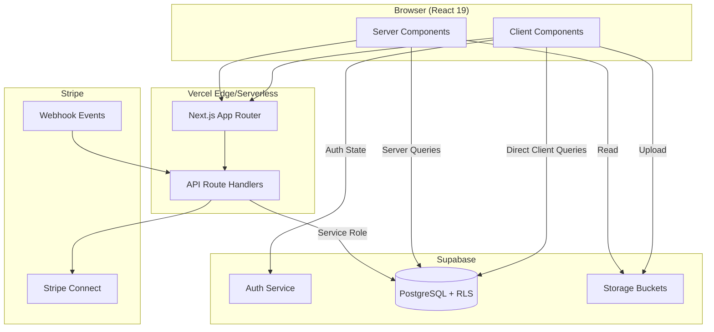
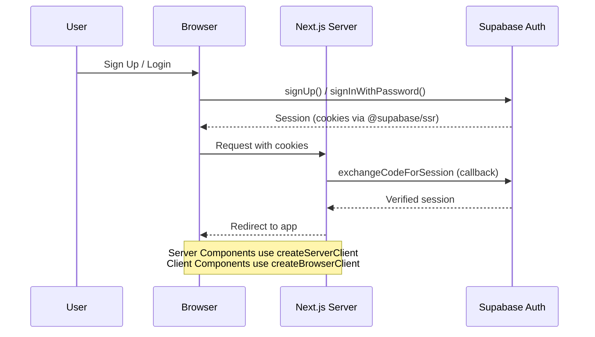
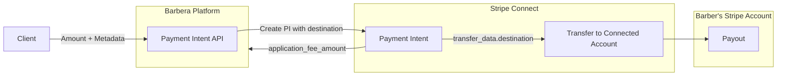

# Architecture

## System Overview

Barbera is a Next.js 15 App Router application deployed on Vercel. It uses a serverless architecture with Supabase providing the database, auth, and file storage layer, and Stripe Connect handling payment processing.

## Rendering Strategy

| Page | Rendering | Reason |
|------|-----------|--------|
| `/[username]` | Server Component (SSR) | SEO, public profile, `revalidate=60` |
| `/discover` | Client Component | Real-time filtering |
| `/dashboard` | Client Component | Auth-gated, personal data |
| `/account` | Client Component | Auth-gated, form interactions |
| `/login`, `/signup` | Client Component | Form state management |
| Landing `/` | Client Component | Interactive hero |

## Authentication Architecture

**Auth patterns used:**
- `@supabase/ssr` — `createBrowserClient` for client components, `createServerClient` for server/route handlers
- `@supabase/auth-helpers-nextjs` — `createServerComponentClient` for server components
- `/auth/callback` route — handles OAuth code exchange and password reset redirects
- Profile completion gate — Navbar redirects to `/complete-profile` if username is missing

## Data Access Patterns

1. **Client-side direct queries** — Client components create a Supabase browser client and query tables directly (protected by RLS)
2. **Server-side queries** — Server components use `createServerComponentClient` with cookie-based auth
3. **Service role access** — API Route Handlers use `SUPABASE_SERVICE_ROLE_KEY` to bypass RLS for cross-user operations (e.g., creating appointments after payment)

## Payment Architecture

- **Model:** Destination charges (customer pays platform, platform transfers to connected account minus fee)
- **Platform fee:** Configurable via `PLATFORM_FEE_PERCENT` env var (default 5%)
- **Webhook:** Listens for `payment_intent.succeeded` to create appointments
- **Fallback:** Client-side also calls `/api/create-appointment` after payment confirmation

## Key Architectural Decisions

1. **No dedicated backend** — All server logic lives in Next.js API Route Handlers
2. **No ORM** — Direct Supabase client queries with typed interfaces
3. **RLS as authorization** — PostgreSQL Row Level Security policies enforce data access rules
4. **Inline styles + Tailwind** — Mixed styling approach (no CSS modules)
5. **No state management library** — Local `useState`/`useEffect` per component
6. **No middleware** — Auth checks happen within components/pages individually
