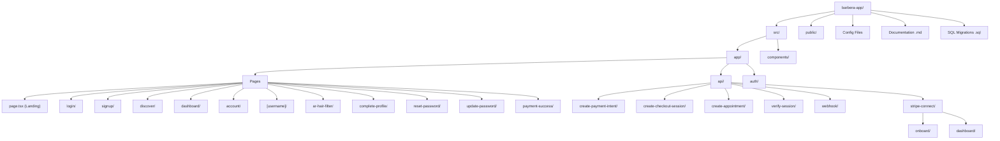

# Codebase Information

## Project Overview

**Name:** Barbera  
**Type:** Web Application (SaaS Marketplace)  
**Description:** A barber-client marketplace platform where barbers showcase portfolios, manage services/availability, and accept bookings with integrated payments. Clients discover barbers, book appointments, and pay seamlessly.

## Technology Stack

| Layer | Technology | Version |
|-------|-----------|---------|
| Framework | Next.js (App Router) | 15.3.8 |
| Language | TypeScript | ^5 |
| UI Library | React | ^19.0.0 |
| Styling | Tailwind CSS | ^4.1.10 |
| Database/Auth | Supabase | ^2.50.0 |
| Payments | Stripe Connect | ^18.3.0 |
| Deployment | Vercel | — |
| Icons | Lucide React | ^0.525.0 |
| Date Handling | date-fns | ^4.1.0 |
| Calendar | react-day-picker | ^9.7.0 |
| Notifications | react-hot-toast | ^2.5.2 |

## Architecture Pattern

- **Rendering:** Mix of Server Components (profile pages) and Client Components (interactive pages)
- **Routing:** Next.js App Router with file-based routing
- **API:** Next.js Route Handlers (REST-style)
- **Auth:** Supabase Auth with SSR cookie-based sessions
- **Database:** Supabase PostgreSQL with Row Level Security (RLS)
- **Payments:** Stripe Connect (destination charges with platform fee)
- **Storage:** Supabase Storage (profile pictures, portfolio media)

## Directory Structure

## User Roles

| Role | Capabilities |
|------|-------------|
| **Barber** | Portfolio management, service/pricing configuration, availability scheduling, Stripe Connect onboarding, view appointments |
| **Customer** | Discover barbers, view portfolios, book appointments, make payments, view booking history |

## Key Features

1. **Portfolio System** — Multi-photo uploads with before/after support, video uploads via Supabase Storage
2. **Services Management** — Barbers define services with name, price, duration
3. **Availability Scheduling** — Day-of-week based recurring availability slots
4. **Booking Flow** — Date picker → time slot selection → payment → appointment creation
5. **Stripe Connect Payments** — Destination charges with configurable platform fee (default 5%)
6. **Profile System** — Dynamic `[username]` routes, profile pictures, bio, location
7. **AR Hair Filter** — Coming soon feature (placeholder page)
8. **Auth Flow** — Email/password signup with profile completion step, password reset

## Environment Variables

| Variable | Purpose |
|----------|---------|
| `NEXT_PUBLIC_SUPABASE_URL` | Supabase project URL |
| `NEXT_PUBLIC_SUPABASE_ANON_KEY` | Supabase anonymous key (client-side) |
| `SUPABASE_SERVICE_ROLE_KEY` | Supabase service role key (server-side, bypasses RLS) |
| `STRIPE_SECRET_KEY` | Stripe API secret key |
| `STRIPE_WEBHOOK_SECRET` | Stripe webhook signature verification |
| `PLATFORM_FEE_PERCENT` | Platform fee percentage (default: 5) |
| `NEXT_PUBLIC_BASE_URL` | App base URL for Stripe redirects |
