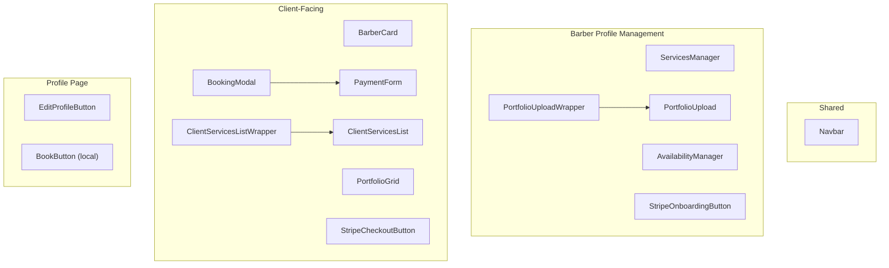

# Components

## Component Map

## Component Details

### Navbar
- **Path:** `src/components/Navbar.tsx`
- **Type:** Client Component
- **Purpose:** Global navigation bar with auth-aware state
- **Behavior:** Shows Sign In/Get Started for guests; Dashboard link + profile avatar for logged-in users. Redirects to `/complete-profile` if username is missing. Responsive (hides nav links on mobile).

### PortfolioGrid
- **Path:** `src/components/PortfolioGrid.tsx`
- **Type:** Client Component
- **Purpose:** Displays a barber's portfolio media in a grid layout
- **Features:** Multi-photo support (JSONB `images` column), video support, lightbox viewing, delete capability for owners

### PortfolioUpload / PortfolioUploadWrapper
- **Path:** `src/components/PortfolioUpload.tsx`, `PortfolioUploadWrapper.tsx`
- **Type:** Client Components
- **Purpose:** Upload photos/videos to barber portfolio via Supabase Storage
- **Features:** Multi-file upload, drag-and-drop, progress tracking, image compression

### BookingModal
- **Path:** `src/components/BookingModal.tsx`
- **Type:** Client Component
- **Purpose:** Multi-step booking wizard
- **Flow:** Service selection → Date picker → Time slot selection → Payment → Confirmation
- **Dependencies:** `react-day-picker`, `date-fns`, `PaymentForm`

### PaymentForm
- **Path:** `src/components/PaymentForm.tsx`
- **Type:** Client Component
- **Purpose:** Stripe Elements card payment form
- **Behavior:** Creates payment intent via `/api/create-payment-intent`, collects card details, creates appointment on success

### ServicesManager
- **Path:** `src/components/ServicesManager.tsx`
- **Type:** Client Component
- **Purpose:** CRUD interface for barbers to manage their services
- **Features:** Add/edit/delete services with name, price, duration

### AvailabilityManager
- **Path:** `src/components/AvailabilityManager.tsx`
- **Type:** Client Component
- **Purpose:** Manage weekly availability schedule
- **Features:** Set start/end times per day of week, toggle days on/off

### BarberCard
- **Path:** `src/components/BarberCard.tsx`
- **Type:** Client Component
- **Purpose:** Card display for barber in discover grid
- **Shows:** Profile picture, username, location, bio excerpt

### ClientServicesList / ClientServicesListWrapper
- **Path:** `src/components/ClientServicesList.tsx`, `ClientServicesListWrapper.tsx`
- **Type:** Client Components
- **Purpose:** Display a barber's services to potential clients on their profile page

### StripeOnboardingButton
- **Path:** `src/components/StripeOnboardingButton.tsx`
- **Type:** Client Component
- **Purpose:** Initiates Stripe Connect onboarding for barbers
- **Behavior:** Calls `/api/stripe-connect/onboard`, redirects to Stripe hosted onboarding

### StripeCheckoutButton
- **Path:** `src/components/StripeCheckoutButton.tsx`
- **Type:** Client Component
- **Purpose:** Alternative checkout flow using Stripe Checkout Sessions

### EditProfileButton
- **Path:** `src/components/EditProfileButton.tsx`
- **Type:** Client Component
- **Purpose:** Shows "Edit Profile" link only if the current user owns the profile

### BookButton (page-local)
- **Path:** `src/app/[username]/BookButton.tsx`
- **Type:** Client Component
- **Purpose:** Opens the BookingModal on the barber's profile page (only shown if not the barber themselves)
