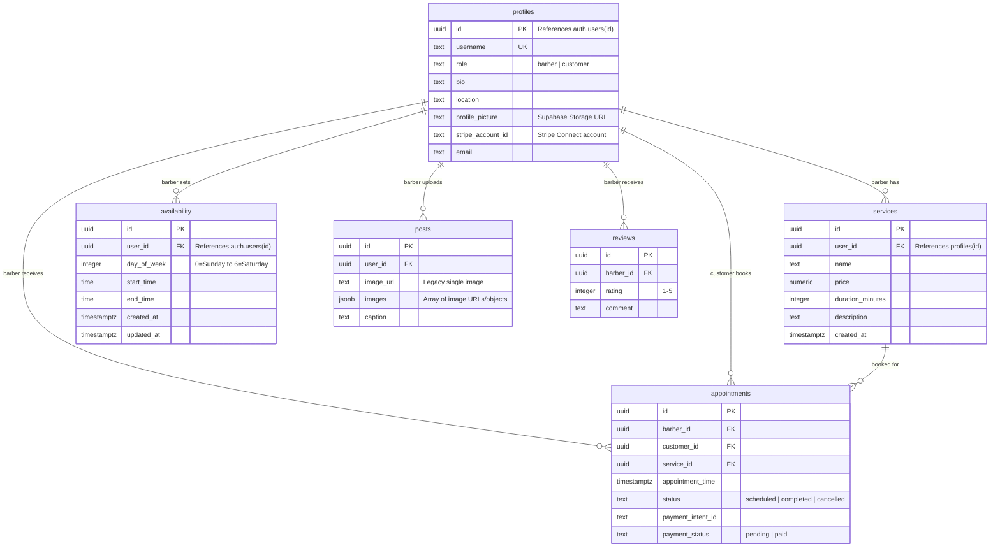

# Data Models

## Database Schema (Supabase PostgreSQL)

## Table Details

### profiles
- **Primary key:** `id` (UUID from `auth.users`)
- **Unique constraint:** `username`
- **RLS:** Users can read all profiles; users can only update their own
- **Notable:** `stripe_account_id` is populated during Stripe Connect onboarding

### services
- **Owner:** Barber (via `user_id`)
- **Pricing:** Stored as decimal (dollars, e.g., `25.00`)
- **Duration:** Integer minutes, used for slot calculation in booking flow

### availability
- **Constraint:** `UNIQUE(user_id, day_of_week)` — one entry per day per barber
- **day_of_week:** 0 = Sunday through 6 = Saturday (JavaScript Date convention)
- **Times:** PostgreSQL `TIME` type, stored as `HH:MM`
- **RLS:** Full CRUD restricted to owning user
- **Trigger:** `updated_at` auto-updates via trigger function

### posts
- **Legacy field:** `image_url` (single URL string)
- **New field:** `images` (JSONB array) — supports multi-photo uploads
- **Constraint:** `jsonb_array_length(images) > 0`
- **Storage:** URLs point to Supabase Storage bucket

### appointments
- **Deduplication:** Unique on `payment_intent_id` (checked before insert)
- **Status flow:** Created as `scheduled` → can become `completed` or `cancelled`
- **Payment tracking:** `payment_status` defaults to `pending`, set to `paid` on successful payment

### reviews
- **Rating:** Integer 1–5, displayed as star characters
- **Simple model:** No reply system, no verified-purchase flag

## Key Relationships

1. A **barber** has services, availability, posts, and receives appointments/reviews
2. A **customer** books appointments and (implicitly) writes reviews
3. An **appointment** links a customer, barber, service, and payment
4. **Availability** determines bookable time slots (combined with existing appointments to filter)

## Storage Buckets (Supabase)

- Profile pictures — uploaded from account page
- Portfolio media — photos and videos uploaded via PortfolioUpload component
- Remote pattern configured: `pkwxnhxgsphapiblxsxe.supabase.co`
