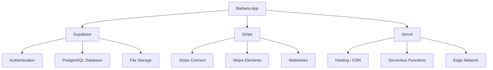

# Dependencies

## Runtime Dependencies

| Package | Version | Purpose |
|---------|---------|---------|
| `next` | 15.3.8 | React framework (App Router, SSR, API routes) |
| `react` / `react-dom` | ^19.0.0 | UI library |
| `@supabase/supabase-js` | ^2.50.0 | Supabase client (database queries, auth) |
| `@supabase/ssr` | ^0.6.1 | SSR-compatible Supabase client (cookie-based sessions) |
| `@supabase/auth-helpers-nextjs` | ^0.10.0 | Server component Supabase client helper |
| `stripe` | ^18.3.0 | Stripe Node.js SDK (server-side) |
| `@stripe/stripe-js` | ^7.6.1 | Stripe.js browser SDK |
| `@stripe/react-stripe-js` | ^3.8.0 | React components for Stripe Elements |
| `date-fns` | ^4.1.0 | Date manipulation (formatting, comparison, slot calculation) |
| `react-day-picker` | ^9.7.0 | Calendar date picker component |
| `lucide-react` | ^0.525.0 | Icon library |
| `lucide` | ^0.525.0 | Icon library (base) |
| `react-hot-toast` | ^2.5.2 | Toast notifications |

## Dev Dependencies

| Package | Version | Purpose |
|---------|---------|---------|
| `typescript` | ^5 | Type checking |
| `tailwindcss` | ^4.1.10 | Utility-first CSS framework |
| `@tailwindcss/postcss` | ^4 | Tailwind PostCSS plugin |
| `postcss` | ^8.5.6 | CSS processing |
| `autoprefixer` | ^10.4.21 | Vendor prefix injection |
| `eslint` | ^9 | Code linting |
| `eslint-config-next` | 15.3.3 | Next.js ESLint rules |
| `@eslint/eslintrc` | ^3 | ESLint flat config compat |
| `@types/node` | ^20 | Node.js type definitions |
| `@types/react` | ^19 | React type definitions |
| `@types/react-dom` | ^19 | ReactDOM type definitions |

## External Services

| Service | Usage | Configuration |
|---------|-------|---------------|
| **Supabase** | Auth, PostgreSQL DB, file storage | Project URL + keys in env vars |
| **Stripe** | Payment processing via Connect | Secret key, webhook secret, platform fee |
| **Vercel** | Hosting, serverless functions, CDN | Automatic via Next.js deployment |

## Dependency Relationships

- `@supabase/ssr` wraps `@supabase/supabase-js` for cookie-based auth in Next.js
- `@supabase/auth-helpers-nextjs` provides `createServerComponentClient` (used in `[username]/page.tsx`)
- `@stripe/react-stripe-js` requires `@stripe/stripe-js` as peer dependency
- `react-day-picker` uses `date-fns` internally and the app also uses `date-fns` for slot calculations
- `tailwindcss` is applied via `@tailwindcss/postcss` plugin in `postcss.config.mjs`

## Notable Patterns

- **No test framework installed** — No Jest, Vitest, or testing-library in devDependencies
- **No state management** — No Redux, Zustand, or similar; all state is local component state
- **No API client layer** — Components call Supabase directly or use fetch for API routes
- **Two Supabase auth patterns coexist** — `@supabase/ssr` (newer) and `@supabase/auth-helpers-nextjs` (legacy)
