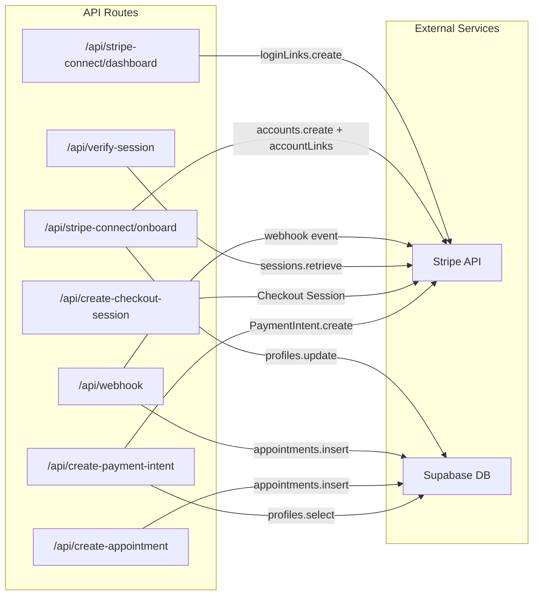

# Interfaces & APIs

## API Route Handlers

All API routes are located under `src/app/api/` and use Next.js Route Handlers (HTTP verbs as exported functions).



### POST `/api/create-payment-intent`

Creates a Stripe PaymentIntent with destination charge to the barber's connected account.

**Request Body:**
```typescript
{
  amount: number;          // Dollar amount
  serviceName: string;
  appointmentTime: string; // ISO datetime
  barberId: string;        // UUID
  customerId: string;      // UUID
  serviceId: string;       // UUID
}
```

**Response:** `{ clientSecret: string }`

**Logic:**
1. Fetches barber's `stripe_account_id` from profiles
2. Validates Stripe account is active and charges-enabled
3. Calculates platform fee (5% default)
4. Creates PaymentIntent with `transfer_data.destination`

### POST `/api/create-checkout-session`

Creates a Stripe Checkout Session (redirect-based payment flow).

**Request Body:**
```typescript
{
  amount: number;
  serviceName: string;
  barberId: string;
  customerId: string;
  serviceId: string;
  appointmentTime: string;
}
```

**Response:** `{ sessionId: string }`

### POST `/api/create-appointment`

Directly creates an appointment record (called after client-side payment confirmation).

**Request Body:**
```typescript
{
  barber_id: string;
  customer_id: string;
  service_id: string;
  appointment_time: string;
  payment_intent_id: string;
}
```

**Response:** `{ success: boolean; appointment: object }`

**Logic:** Uses service role to bypass RLS. Checks for duplicates via `payment_intent_id`.

### POST `/api/verify-session`

Verifies a Stripe Checkout Session and retrieves payment details.

**Request Body:** `{ session_id: string }`  
**Response:** Payment intent details and metadata

### POST `/api/webhook`

Handles Stripe webhook events. Verifies signature with `STRIPE_WEBHOOK_SECRET`.

**Handled Events:**
- `payment_intent.succeeded` — Creates appointment from payment metadata
- `payment_intent.payment_failed` — Logs failure

### POST `/api/stripe-connect/onboard`

Initiates Stripe Connect onboarding for a barber.

**Auth:** Requires authenticated session  
**Logic:**
1. Creates or retrieves Stripe connected account
2. Stores `stripe_account_id` in profiles table
3. Creates Account Link for hosted onboarding
4. Returns redirect URL

**Response:** `{ url: string }`

### POST `/api/stripe-connect/dashboard`

Creates a Stripe Express Dashboard login link for a connected barber.

**Auth:** Requires authenticated session  
**Response:** `{ url: string }`

## Auth Callback

### GET `/auth/callback`

Handles Supabase auth code exchange. Used for:
- OAuth provider callbacks
- Email confirmation links
- Password reset links (redirects to `/update-password`)

## Client-Side Supabase Interface

Components access Supabase directly via the browser client. Key tables queried:

| Table | Queried From | Operations |
|-------|-------------|-----------|
| `profiles` | Navbar, Account, Discover, Profile pages | SELECT, UPDATE |
| `services` | Account, Profile, BookingModal | SELECT, INSERT, UPDATE, DELETE |
| `availability` | AvailabilityManager, BookingModal | SELECT, INSERT, UPDATE, DELETE (UPSERT) |
| `posts` | Profile page, PortfolioUpload, PortfolioGrid | SELECT, INSERT, DELETE |
| `appointments` | Dashboard | SELECT |
| `reviews` | Profile page | SELECT |
