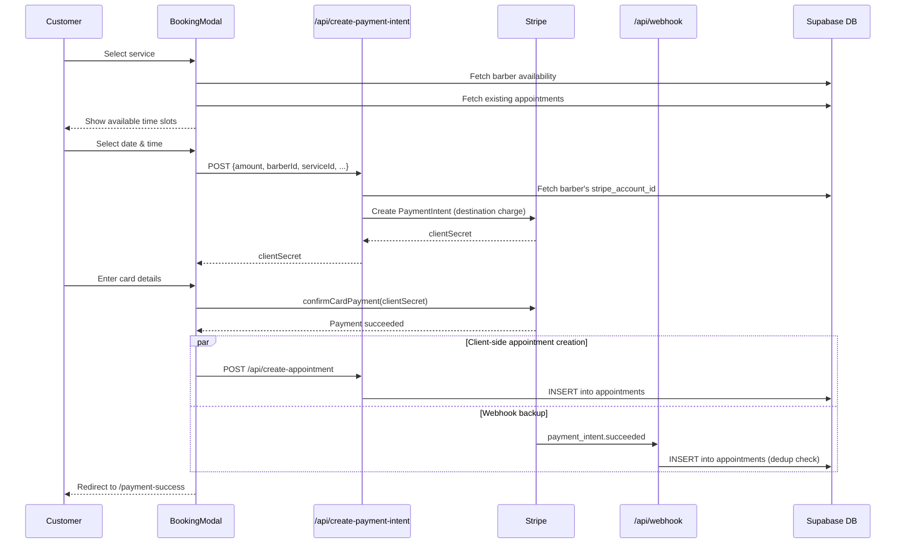
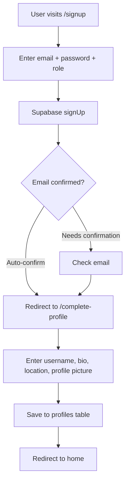
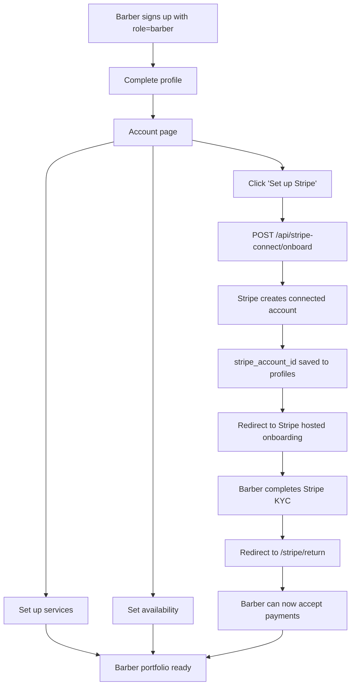
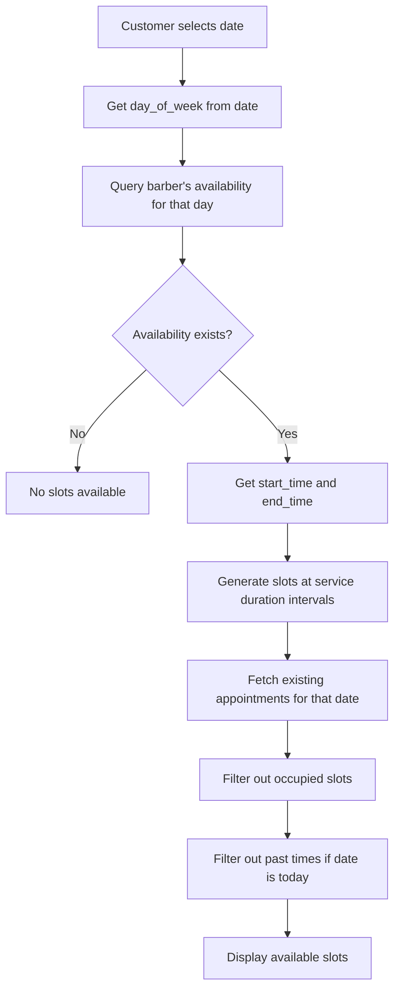
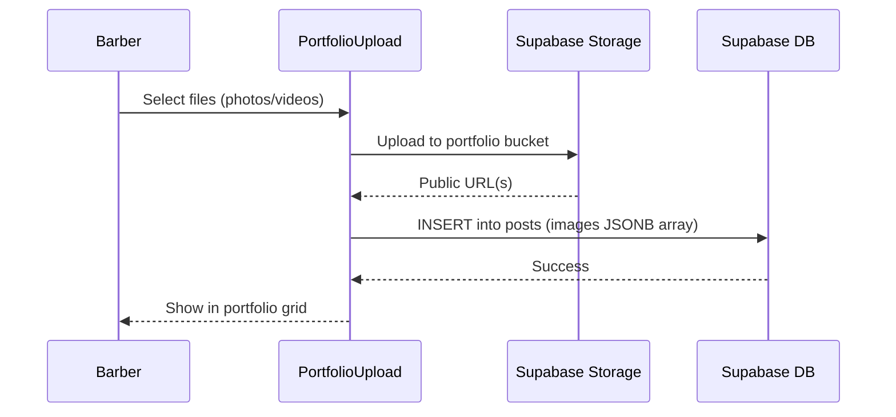
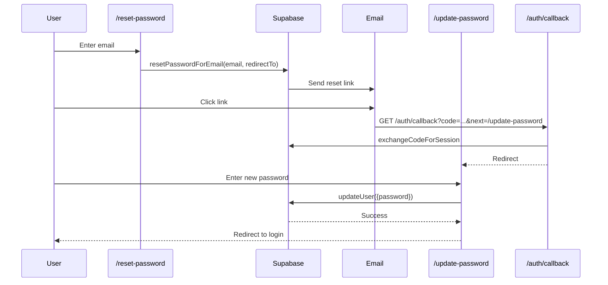

# Workflows

## Booking & Payment Flow

The core business workflow from client discovery to completed appointment.

## User Registration Flow

## Barber Onboarding Flow

## Time Slot Calculation

## Portfolio Upload Flow

## Password Reset Flow

